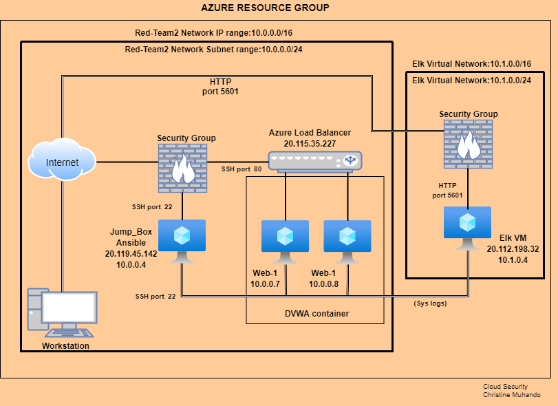
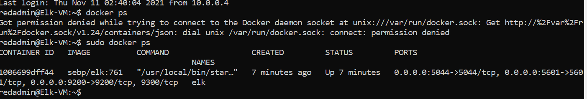

# Elk-Stack-Project
## Automated ELK Stack Deployment

The files in this repository were used to configure the network depicted below.

These files have been tested and used to generate a live ELK deployment on Azure. They can be used to either recreate the entire deployment pictured above. Alternatively, select portions of the playbook file may be used to install only certain pieces of it, such as Filebeat.

 
This document contains the following details:
- Description of the Topology
- Access Policies
- ELK Configuration
  - Beats in Use
  - Machines Being Monitored
- How to Use the Ansible Build

### Description of the Topology

The main purpose of this network is to expose a load-balanced and monitored instance of DVWA, the D*mn Vulnerable Web Application.

Load balancing ensures that the application will be highly available and reliable, in addition to restricting access to the network.
Load balancer protects against denial-of-service attack (DDoS) by redirecting the attack traffic from corporate server to a public cloud provider. 
Jump box is highly secured computer and can only used for administrative tasks.

Integrating an ELK server allows users to easily monitor the vulnerable VMs for changes to the data and system logs.
Filebeat watch for suspicious changes in the file system.
Metricbeat record specific information about the machines in the network like memory, cpu usage, disk IO etc.

The configuration details of each machine may be found below.

| Name     | Function | IP Address | Operating System |
|----------|----------|------------|------------------|
| Jump_Box | Gateway  | 10.0.0.4   | Linux            |
| Web-1    | Webserver| 10.0.0.7   | Linux            |
| Web-2    | Webserver| 10.0.0.8   | Linux            |
| Elk      | Webserver| 10.1.0.4   | Linux            |

### Access Policies

The machines on the internal network are not exposed to the public Internet. 

Only the Jump-Box accept connections from the Internet. Access to this machine is only allowed from my home IP address.

Machines within the network can only be accessed by Jump_Box VM.
Machine that I allow to access the ELK VM is Jump_Box which IP address is 10.0.0.4 

A summary of the access policies in place can be found in the table below.

| Name     | Publicly Accessible | Allowed IP Addresses |
|----------|---------------------|----------------------|
| Jump_Box | Yes/No              | My home IP           |
| Web-1    | No                  | 10.0.0.7             |
| Web-2    | No                  | 10.0.0.8             |
| Elk      | Yes/No              | 10.1.0.4             |

### Elk Configuration

Ansible was used to automate configuration of the ELK machine. No configuration was performed manually, which is advantageous because it saves time, no need to spend hours configure the machines manually. 

The playbook implements the following tasks:
- Install docker.io
- Install pip3
- Istall Docker python module
- Install and launch a docker container

The following screenshot displays the result of running `docker ps` after successfully configuring the ELK instance.

### Target Machines & Beats
This ELK server is configured to monitor the following machines:
- Web-1 10.0.0.7
- Web-2 10.0.0.8

We have installed the following Beats on these machines:
- Filebeat
- Metricbeat
These Beats allow us to collect the following information from each machine:
- Filebeat collects log events and guarantees that these events are delivered to the configured output with no data loss.
- Metricbeat collects metrics from server's operating system and running services then it ships metrics and statistics collected to the specified output.

### Using the Playbook
In order to use the playbook, you will need to have an Ansible control node already configured. Assuming you have such a control node provisioned: 
SSH into the control node and follow the steps below:
- Copy the ELK playbook (./elk-playbook.yml) to /etc/ansible/roles/ folder.
- Update the hosts file to include IP addresses of Webservers and ELK server.
- Run the playbook, and navigate to http://[your.ELK-VM.Public.IP]:5601/app/kibana. to check that the installation worked as expected.

Commands the user will need to run to download the playbook, update the files, etc._
- ansible-playbook <playbook.yml> - run playbook
- ansible-playbook --user=<hosts> apt.yml
